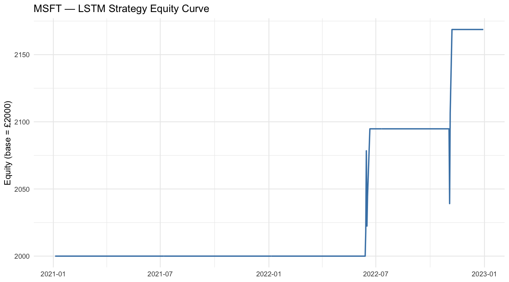
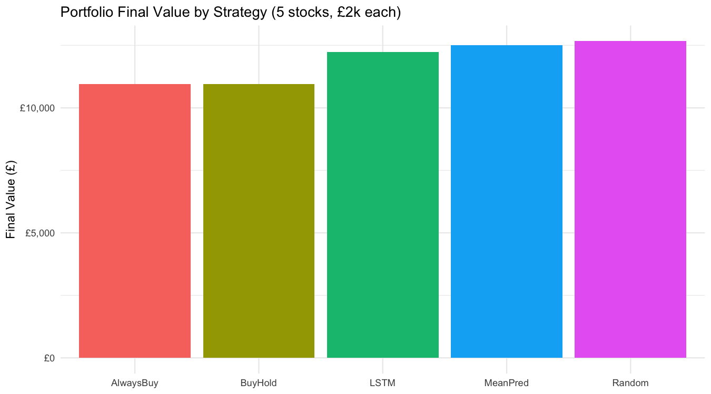

# 🤖 LSTM-Based Trading Strategy: Deep Learning for Financial Forecasting

A complete **algorithmic trading framework** built in **R** that applies **LSTM neural networks** to forecast next-day prices and generate trading signals.
The system evaluates multiple assets, applies a trading rule, and compares performance with **Buy & Hold**, **Mean Predictor**, **Always-Buy**, and **Random** baselines.

Developed as part of the **MSc Data Science program at the University of Strathclyde**.

---

## 🎯 Objectives

* Forecast daily stock prices using **LSTM deep learning**.
* Design **rule-based trading logic** (Buy/Sell based on predicted price change thresholds).
* Evaluate performance using **Sharpe Ratio**, **Profit**, and **Directional Accuracy**.
* Compare LSTM results with baseline strategies on equal capital allocation.
* Generate clear, reproducible outputs and visualizations.

---

## 🧠 Methodology

### 1. Data

* Assets: **MSFT, AAPL, GOOG, WMT, HPE**
* Source: *Yahoo Finance* via `quantmod`
* Training period: 2013–2020
* Testing period: 2021–2022
* Split ensures out-of-sample validation

### 2. Feature Engineering

* Raw price series normalized via Min–Max scaling
* Lookback window: 30 days of past closing prices
* Target: Next-day close

### 3. Model Architecture

* Framework: `keras` (R interface for TensorFlow)
* Layers:

  * `LSTM(50)`
  * `Dense(1)`
* Optimizer: **Adam**
* Loss: **MSE**
* Epochs: 15, Batch size: 32

### 4. Trading Logic

* **BUY** when predicted return ≥ +2.5%
* **SELL (or Flat)** when predicted return ≤ −2.5%
* Long-only strategy, holding until next signal
* Capital: £2000 per stock

### 5. Baseline Strategies

| Strategy           | Description                                              |
| ------------------ | -------------------------------------------------------- |
| **Buy & Hold**     | Hold one share from start to end                         |
| **Always-Buy**     | Always in market (identical to Buy & Hold for long-only) |
| **Mean Predictor** | Predicts next price as k-day rolling average (k=5)       |
| **Random**         | Random buy/sell signals for benchmark noise floor        |

---

## ⚙️ Tech Stack

`R` · `keras` · `quantmod` · `dplyr` · `ggplot2` · `PerformanceAnalytics` · `tidyr`

---

### 📊 **Per-Stock Results — LSTM Trading Strategy**

| 🏢 Stock | 💰 Final Value (£) | 📈 Profit (£) | ⚖️ Sharpe Ratio | 🎯 Directional Accuracy (%) |
| :------- | -----------------: | ------------: | :-------------: | :-------------------------: |
| **MSFT** |     **£ 2,168.72** |       +168.72 |      0.829      |            51.4 %           |
| **AAPL** |     **£ 2,109.93** |       +109.93 |      0.394      |            51.6 %           |
| **GOOG** |     **£ 2,033.91** |        +33.91 |      0.139      |            47.8 %           |
| **WMT**  |     **£ 2,544.33** |   **+544.33** |    **1.115**    |          **52.6 %**         |
| **HPE**  |     **£ 3,371.20** | **+1,371.20** |    **1.491**    |            46.6 %           |

> 💾 *Full metrics available in [`results/final_values.csv`](results/final_values.csv)*
> 📊 *Each stock received an equal £ 2,000 allocation.*

---

### Portfolio Totals

| Strategy           | Final Value (£) | Initial (£) |   Profit (£) |
| ------------------ | --------------: | ----------: | -----------: |
| **LSTM**           |   **12,228.09** |      10,000 |     2,228.09 |
| **Buy & Hold**     |       10,959.17 |      10,000 |       959.17 |
| **Always-Buy**     |       10,959.17 |      10,000 |       959.17 |
| **Mean Predictor** |       12,515.85 |      10,000 |     2,515.85 |
| **Random**         |       12,665.51 |      10,000 | **2,665.51** |

📈 *See [`results/strategy_portfolio_totals.csv`](results/strategy_portfolio_totals.csv) for CSV version.*

---

### Visualizations

**Equity Curves (per stock)**


**Portfolio Comparison (by strategy)**


---

## 🧩 Key Insights

* The **LSTM** strategy delivered consistent gains across most assets, though certain baselines occasionally matched or exceeded it — highlighting realistic model variance.
* **Mean Predictor** surprisingly achieved strong performance, showing how statistical heuristics remain competitive in short-horizon forecasting.
* **Random strategy** occasionally performed well due to market drift, not predictive power — emphasizing the importance of rigorous baselines.
* Reinforces that **deep learning’s value** lies in adaptability across regimes, not guaranteed outperformance.
* Demonstrates full **pipeline automation** from data → forecast → trading → analysis.

---

## ▶️ How to Run

```r
# Install dependencies (first time only)
install.packages(c("keras","quantmod","dplyr","ggplot2","scales","PerformanceAnalytics","tidyr","TTR"))
library(keras); install_keras()

# 1️⃣ LSTM Forecasting + Trading (per stock)
source("R/01_lstm_forecasting.R")

# 2️⃣ Strategy Comparison (baselines vs LSTM)
source("R/02_strategy_comparison.R")
```

All outputs will be saved automatically in the `/results/` folder.

---

## 📁 Repository Structure

```
lstm-trading-strategy/
│
├── R/
│   ├── 01_lstm_forecasting.R      # LSTM training & trading
│   └── 02_strategy_comparison.R   # Baseline comparison
├── data/                          # optional (not committed)
├── results/                       # charts, CSVs
└── README.md
```

---

## 👨‍💻 Author

**Ankit Kothawade**
MSc Data Science | University of Strathclyde
📍 Glasgow, United Kingdom
📫 [ankitkkothawade@gmail.com](mailto:ankitkkothawade@gmail.com) · [LinkedIn](https://linkedin.com/in/ankit-kothawade)

---

### 🏷️ Tags

`#DataScience` · `#FinanceAI` · `#DeepLearning` · `#AlgorithmicTrading` · `#RStats` · `#MachineLearning` · `#LSTM`

---
